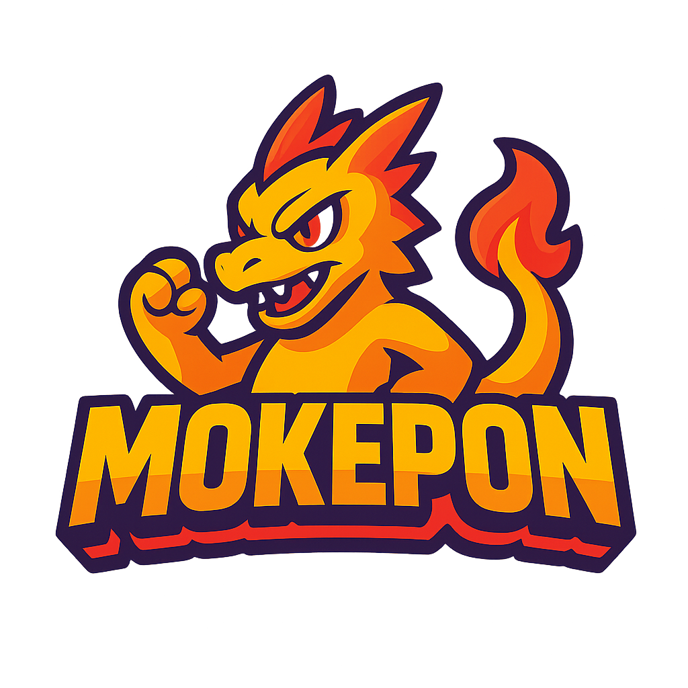

# Mokepon 

![Logo]<p align="center">
  
</p>
*¡Bienvenido a Mokepon, tu juego de aventuras con Mokepones!*

---

## 🔹 Descripción

Mokepon es un juego interactivo desarrollado con **Node.js**.  
En este juego puedes elegir tu Mokepon, explorar el mapa y combatir contra otros Mokepones usando distintos ataques estratégicos.

---

## 🔹 Requisitos

Antes de ejecutar el proyecto, asegúrate de tener instalado:

- [Node.js](https://nodejs.org/) 

---

## 🔹 Instalación

1. Clona este repositorio:

```bash
git clone https://github.com/MoncadaLeonardo/Mokepon.git
